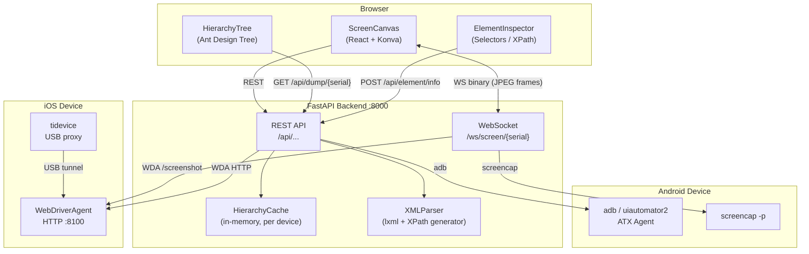

# Android UI Inspector

A real-time UI inspection tool for **Android and iOS devices**, similar to Appium Inspector or uiautodev.
It streams the device screen to a browser, dumps the UI hierarchy, generates unique XPath/selector expressions, and lets you tap or swipe the device directly from the web UI.

---

## Features

- **Live screen stream** — WebSocket-based JPEG stream with \<1 s latency
- **UI Hierarchy Tree** — dumps the native view hierarchy (Android: uiautomator2; iOS: WebDriverAgent)
- **Element Inspector** — shows all attributes and auto-generates XPath, resource-id, accessibility-id selectors
- **Shortest-unique XPath** — algorithm walks descendant → sibling → parent → uncle → cousin to find the most robust selector
- **Tap & Swipe** — click-to-tap or drag-to-swipe from the canvas, forwarded to the device
- **Download** — export the raw XML hierarchy or the current screenshot with one click
- **Multi-device** — switch between connected Android and iOS devices from a dropdown

---

## Architecture



### Component overview

| Layer | Technology | Role |
|-------|-----------|------|
| Frontend | React 18 + Vite + TypeScript | Browser UI |
| Canvas | react-konva (Konva.js) | Screen stream rendering, overlays |
| UI Components | Ant Design 5 | Tree, Inspector, layout |
| Backend | FastAPI + uvicorn | REST API + WebSocket server |
| Android bridge | adbutils + uiautomator2 | Screenshot, hierarchy dump, tap/swipe |
| iOS bridge | tidevice (USB proxy) + WebDriverAgent | Screenshot, hierarchy dump, tap/swipe |
| XML parsing | lxml | Hierarchy parsing, XPath generation |

---

## Prerequisites

| Requirement | Version | Notes |
|-------------|---------|-------|
| Python | 3.11+ | 3.12 may have tidevice issues; 3.11 recommended |
| Node.js | 18+ | For building the frontend |
| npm | 9+ | Bundled with Node 18 |
| ADB | any recent | Required for Android devices |
| tidevice | latest | Required for iOS devices (`pip install tidevice`) |
| WebDriverAgent | pre-installed on device | Required for iOS; auto-detected by bundle ID |

---

## Quick Start

```bash
# 1. Clone
git clone https://github.com/your-org/android-ui-inspector.git
cd android-ui-inspector

# 2. Build the frontend (first time, or after frontend changes)
./build.sh

# 3. Install the Python package (editable mode)
pip install -e .

# 4. Launch — opens the browser automatically
android-ui-inspector
```

### CLI options

```
android-ui-inspector                   # default: http://127.0.0.1:8000, auto-open browser
android-ui-inspector --port 9000       # custom port
android-ui-inspector --host 0.0.0.0   # allow LAN access
android-ui-inspector --no-open        # suppress auto-open
```

---

## Development Mode

Run backend and frontend separately for hot-reload:

```bash
# Terminal 1 — Backend (FastAPI, port 8000)
cd backend
python main.py

# Terminal 2 — Frontend (Vite dev server, port 5173)
cd frontend
npm install
npm run dev
```

The Vite dev server proxies `/api` and `/ws` to `http://localhost:8000` (configured in `frontend/vite.config.ts`).

---

## Android Setup

1. Enable **Developer Options** and **USB Debugging** on the device.
2. Connect via USB. Verify with:

   ```bash
   adb devices
   ```

3. The backend auto-installs the ATX agent (`uiautomator2`) on first use.

---

## iOS Setup

1. Build and install **WebDriverAgent** on the device via Xcode. The WDA bundle ID is auto-detected at runtime.

2. Install **tidevice**:

   ```bash
   pip install tidevice
   ```

3. Connect the device via USB. The backend starts `tidevice wdaproxy` automatically when an iOS device is selected.

4. **Optional** — if you already have WDA running (e.g., started by Appium), point the backend at it directly:

   ```bash
   IOS_WDA_URL=http://127.0.0.1:8100 android-ui-inspector
   ```

   > Note: iOS only supports one active WDA session at a time. Do not run this tool and Appium Inspector simultaneously.

---

## Environment Variables

Set these before starting the backend (or in `backend/.env`):

| Variable | Default | Description |
|----------|---------|-------------|
| `IOS_WDA_LOCAL_PORT` | `8100` | Local port for the `tidevice wdaproxy` tunnel |
| `IOS_WDA_URL` | *(auto)* | Skip auto-launch; connect directly to this WDA URL |
| `IOS_WDA_DEVICE_MAP` | *(none)* | Map device serials to WDA URLs, e.g. `serial1=http://127.0.0.1:8100,serial2=http://127.0.0.1:8200` |
| `IOS_WDA_FAILURE_THRESHOLD` | `5` | Consecutive screenshot failures before restarting WDA proxy |

---

## API Reference

Base URL: `http://localhost:8000`

| Method | Path | Description |
|--------|------|-------------|
| GET | `/api/devices` | List all connected devices (Android + iOS) |
| GET | `/api/devices/{serial}/info` | Device metadata (model, resolution, platform) |
| GET | `/api/screenshot/{serial}` | Single screenshot (PNG) |
| GET | `/api/dump/{serial}` | Dump and parse UI hierarchy (JSON); result is cached |
| GET | `/api/dump/{serial}/xml` | Download cached raw XML hierarchy |
| POST | `/api/element/info` | Get element attributes and selectors by node path |
| POST | `/api/element/find-by-coordinate` | Find the element at screen coordinates (x, y) |
| POST | `/api/xpath/query` | Run an XPath expression against the cached hierarchy |
| POST | `/api/tap` | Send a tap event to the device |
| POST | `/api/swipe` | Send a swipe event to the device |
| POST | `/api/stream/stop/{serial}` | Stop background streaming resources (iOS: terminates WDA proxy) |
| WS | `/ws/screen/{serial}` | Real-time JPEG screen stream (binary frames) |

Interactive API docs are available at `http://localhost:8000/docs` when the server is running.

---

## Project Structure

```
android-ui-inspector/
├── android_ui_inspector/       # CLI entry point (pip install target)
│   ├── __init__.py
│   └── __main__.py             # argparse → uvicorn launcher
├── backend/                    # FastAPI backend
│   ├── main.py                 # App factory, all API routes, WebSocket handler
│   ├── xml_parser.py           # XML parse + unique XPath generation
│   └── device_manager/
│       ├── __init__.py         # DeviceManager facade, routing by platform
│       ├── base.py             # Abstract base class
│       ├── android_manager.py  # adbutils + uiautomator2 integration
│       └── ios_manager.py      # tidevice + WebDriverAgent integration
├── frontend/                   # React + Vite frontend
│   ├── src/
│   │   ├── App.tsx             # Root component, device selection, layout
│   │   ├── components/
│   │   │   ├── ScreenCanvas.tsx      # Live stream, tap/swipe, element overlays
│   │   │   ├── HierarchyTree.tsx     # Collapsible XML tree
│   │   │   ├── ElementInspector.tsx  # Attribute table + selectors
│   │   │   └── XPathPlayground.tsx   # Live XPath query tester
│   │   ├── services/api.ts     # All fetch/WebSocket calls
│   │   └── types/index.ts      # Shared TypeScript types
│   ├── vite.config.ts
│   └── package.json
├── tests/                      # Debug / integration scripts
├── build.sh                    # Build frontend → frontend/dist/
├── pyproject.toml              # Python package config
└── .gitignore
```

---

## License

MIT
